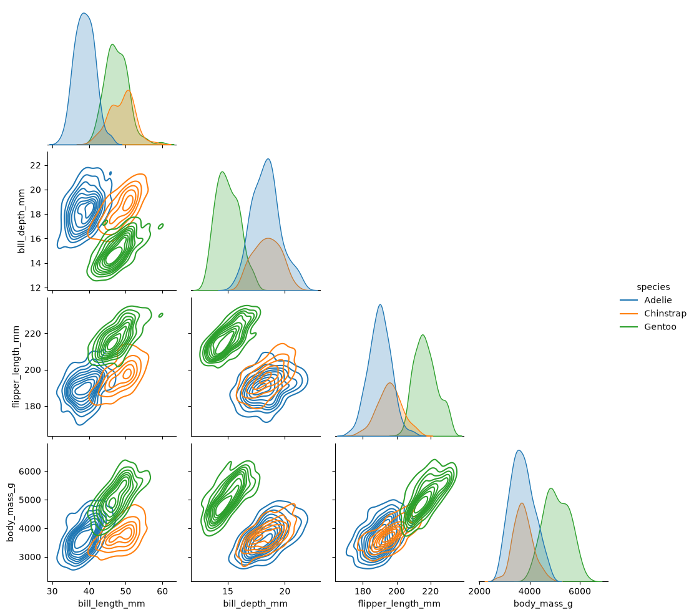
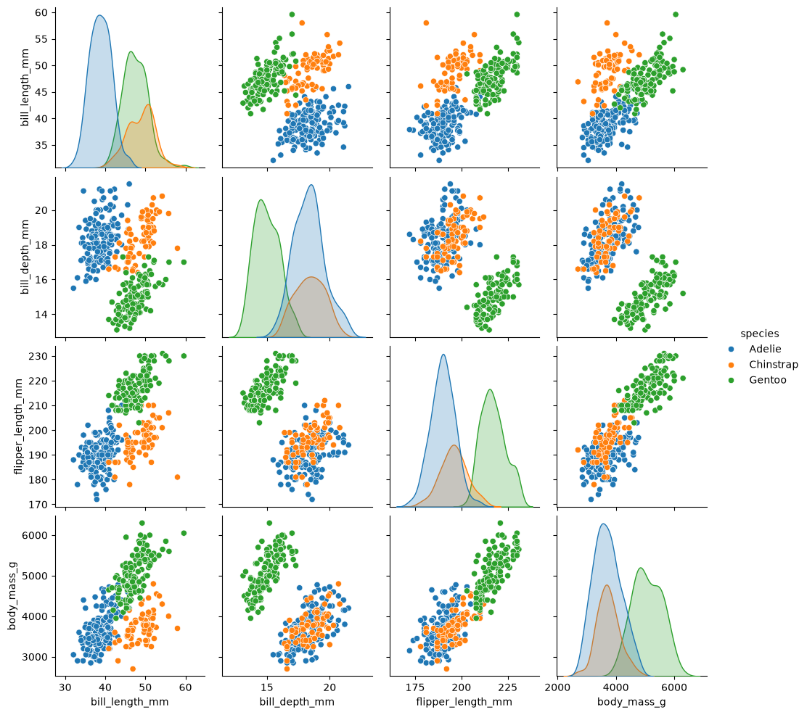
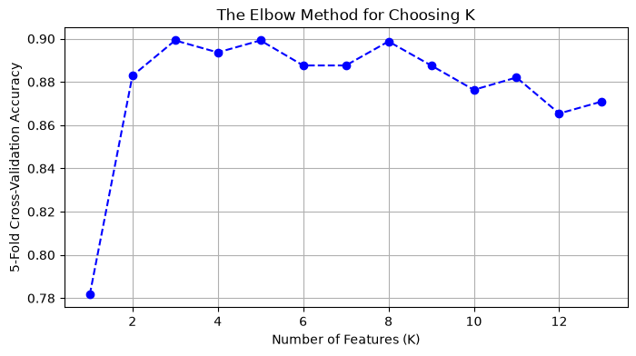
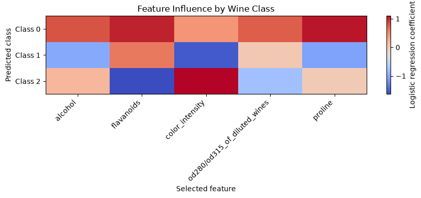
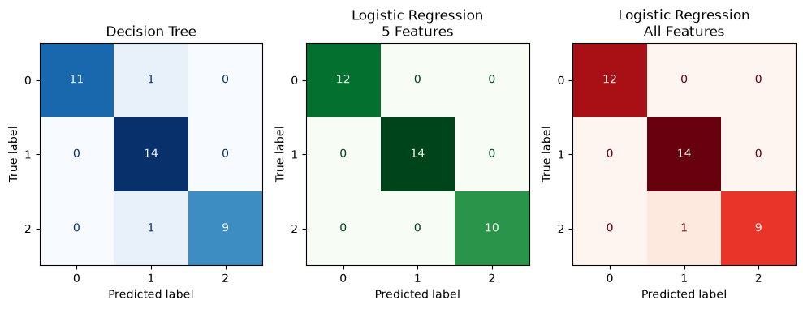

# Project Documentation

## Phase 4. Technical Modification

In phase 4 I added a pairplot to look at the relationships between the numerical data first with simple scatter plots and then with the kde option to see which features showed distinct species clusters.

The example model already shows feature weights and bill depth and body mass have 1/10th the weight of the other 2 features. It's interesting to see that those two features show the most cluster overlap.

## Phase 5. Custom Project
For my custom project I used a new dataset from Sci-Kit Learn. This toy dataset looks at 178 Italian Wines made by 3 different "Cultivars" 

[Lichman, M. (2013). UCI Machine Learning Repository](https://archive.ics.uci.edu/ml). 

### Basis and Data

The dataset contained 13 features, and the target was a classifcation oh which cultivar (out of 3) peoduced the wine.

| alcohol | malic_acid | ash | alcalinity_of_ash | magnesium | total_phenols | flavanoids | nonflavanoid_phenols | proanthocyanins | color_intensity | hue | od280/od315_of_diluted_wines | proline |
| :--- | :--- | :--- | :--- | :--- | :--- | :--- | :--- | :--- | :--- | :--- | :--- | :--- |
| | | | | | | | | | | | | |

### Modeling Approach

The original pipeline (Decision Tree Classification Model) with the addition of the phase 4 plots was used. The original model's precision and accuracy were at acceptable values.

| Cultivar Class | precision | recall | f1-score | support |
| :--- | :--- | :--- | :--- | :--- |
| **0** | 1.00 | 0.92 | 0.96 | 12 |
| **1** | 0.88 | 1.00 | 0.93 | 14 |
| **2** | 1.00 | 0.90 | 0.95 | 10 |
| **accuracy** | | | 0.94 | 36 |
| **macro avg** | 0.96 | 0.94 | 0.95 | 36 |
| **weighted avg** | 0.95 | 0.94 | 0.94 | 36 |

I then used a logistic regression model to predict the class, one with all features, and one with 5 features.

### Target

Explain how your target choice changes the modeling approach, interpretation, or evaluation.
The example target was penguin species, it had a few numerical features with clear separations. The chemical components for predicting wine cultivar didn't show clear clusters and had more features. The Sci-Kit Learn documentation indicated that logistic regression could work well in classification problems.

### Features

I wanted to see how the model could be improved. 
The original model was used to look at "K" cross-validation. In other words how many features best improved the model.The option "mutual_info_classif" was used since there was no clear linear correlations. 

The plot didn't show a clear value, several selected features improved accuracy, I chose to use a K value of 5.

I also plotted the influence of the 5 selected features.

### Evaluation and Results

The logistic regression with narrowed features was perfect. But this may have been an artifact of not approaching this rigorously. Selecting features from one model and then using them in another isn't reccomended. 

### Summary

This project shows a good introduction to modeling supervised classification problems. In the future I'd improve it by cross validating to each unique model and using a different feature selection method (RCVA) for the decision tree.
